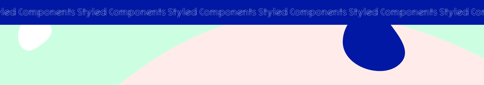

<h1 align="center">
  <a href="">
    
  </a>
</h1>

# React Design Replication Exercise with Styled Components

For this week's class, we will replicate a given design using React and style it using Styled Components. We will try to match the design closely using Styled Components for smooth styling.

## Getting Started with the Project

### Dependency Installation & Startup Development Server:

Navigate to the project's root directory and this project uses npm (Node Package Manager) to manage its dependencies.

The command below is a combination of installing dependencies, opening up the project on VS Code and it will run a development server on your terminal.

```bash
npm i && code . && npm run dev
```

## Looking for some hints?

### Fonts Used

- Raleway - It's pre-installed.

### Installing styled-components

1.  Installation Command: To add `styled-components` to your project, use one of the following commands:

    - If you're using `npm`:

    ```bash
      npm install styled-components
    ```

2.  Usage in Project: After installation, you can start using it in your React components by importing:

```bash
import styled from 'styled-components;
```

## Landing Page Demo

[Working Demo of the website](https://technigo-news-site-grid-demo.netlify.app/)

If you choose to opt out from using the inspector on your browser you can check the styles being applied on the working demo [here](https://github.com/Technigo/exercise-w11-styled-components/blob/main/src/finished-styles-regular-css.css)

- Logos, imgs and videos are all fetched from the web, you can find these links inside this [json file](https://github.com/Technigo/exercise-w11-styled-components/blob/main/src/assets/images-videos.json)


## CSS Units

### Absolute Units:
- px (Pixels): A pixel is a single dot on a screen. It's a fixed-size unit and is widely used for precise control over layout.
- pt (Points): A point is a unit of length commonly used in typography. It's equivalent to 1/72 of an inch. It's primarily used in print media.

### Relative Units:
- % (Percentage): A percentage is a relative unit that represents a proportion of another value. For example, width: 50%; means the element's width is half of its containing block.
- em: An em is a unit that is relative to the font size of its parent element. For example, if the font size of the parent element is 16px, 1em equals 16px.
- rem: Similar to em, but it's relative to the font size of the root element (html), rather than the parent element.
- vw (Viewport Width): A unit relative to the width of the viewport. 1vw is equal to 1% of the viewport's width.
- vh (Viewport Height): Similar to vw, but it's relative to the height of the viewport.